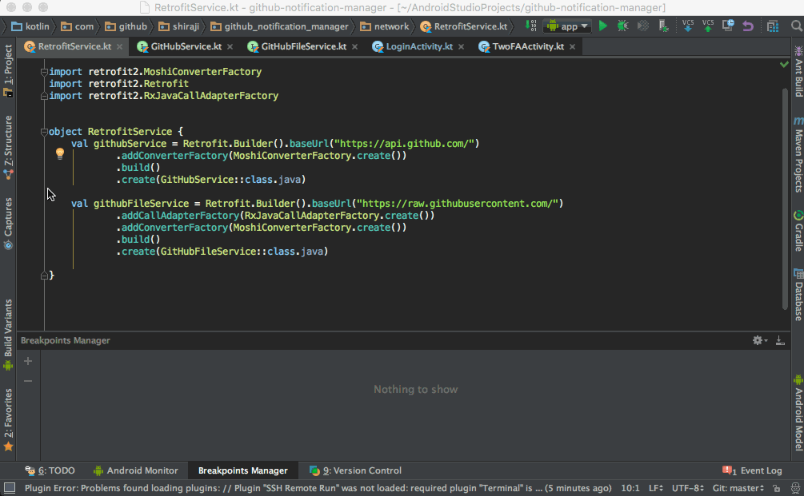
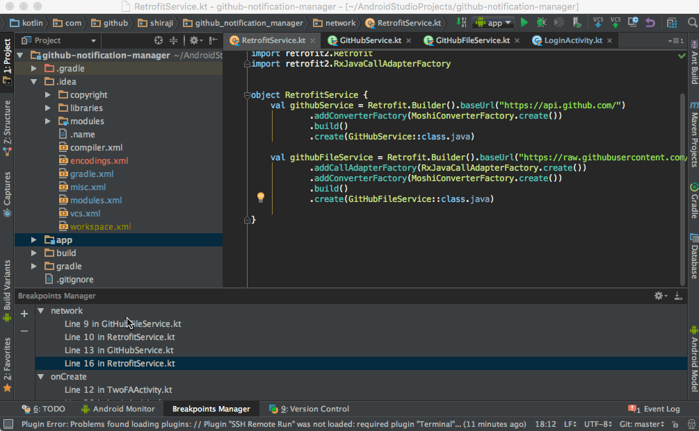

# Breakpoints Manager

This is an IntelliJ plugin that lets developers share sets of breakpoints.

# How to save breakpoints?

* Add breakpoints
* Open Breakpoints Manager tool window
* Click "+"
* Type name of the breakpoints set



# How to share breakpoints to team?

* Select the set of breakpoints
* Right Click
* Click `Share selected breakpoint[s] to project`
* The plugin creates `.idea/breakpointManagerConfig.xml` and add/commit/push the file



# How to delete breakpoints set?

* Select the set of breakpoints
* Right Click
* Click `Remove the selected breakpoint[s] from settings`

or

* Select the set of breakpoints
* Click "-"

# How to install?

Use the IDE's plugin manager to install the latest version of the plugin.

# Limitation

Current version has the following Limitation

* Does not support Exception breakpoints
* Does not support editing breakpoints (except removing from saved breakpoints)
* Save breakpoints that currently set on the project

## License

```
Copyright 2016 Yoshinori Isogai

Licensed under the Apache License, Version 2.0 (the "License");
you may not use this file except in compliance with the License.
You may obtain a copy of the License at

   http://www.apache.org/licenses/LICENSE-2.0

Unless required by applicable law or agreed to in writing, software
distributed under the License is distributed on an "AS IS" BASIS,
WITHOUT WARRANTIES OR CONDITIONS OF ANY KIND, either express or implied.
See the License for the specific language governing permissions and
limitations under the License.
```
